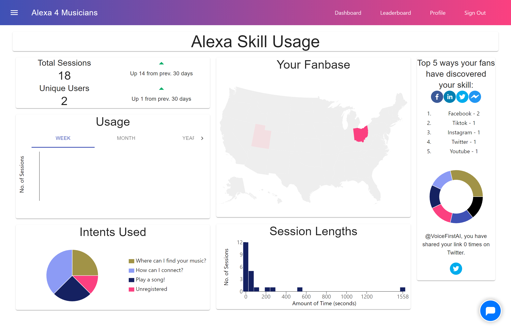
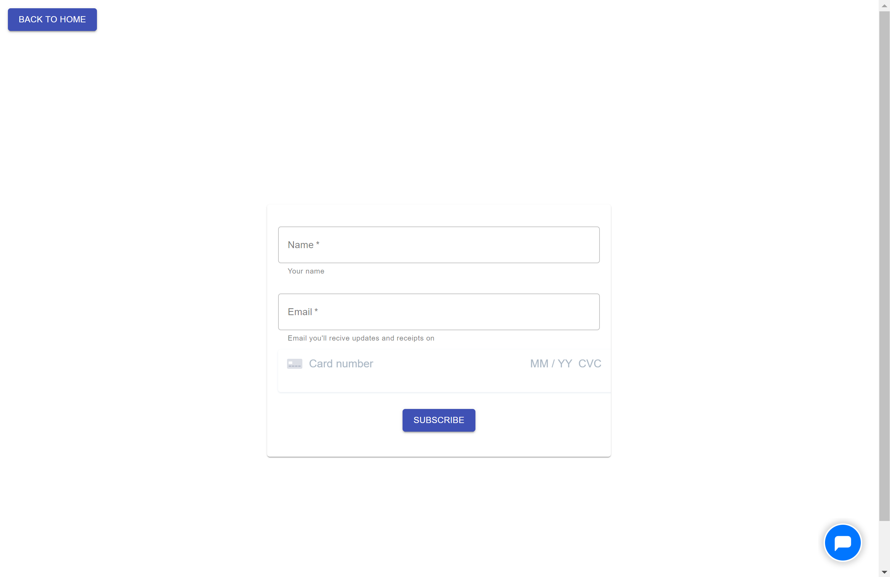
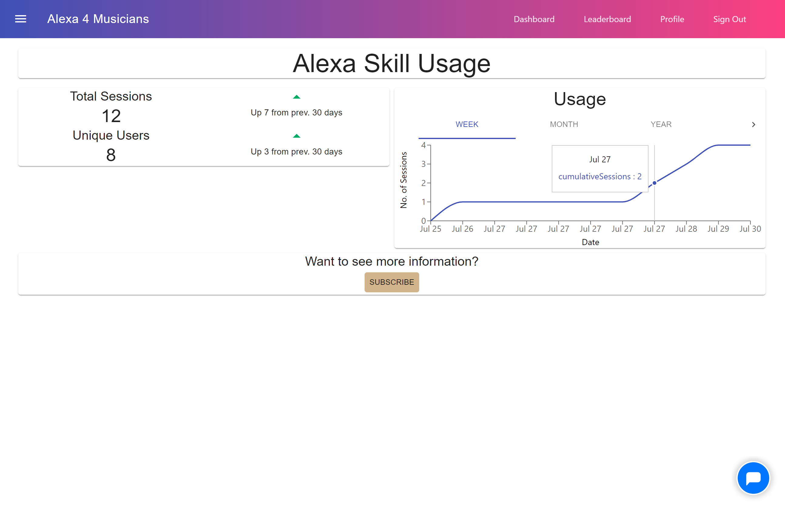

# Music by the Numbers
Data visualization dashboard that is used on [Alexa4Musicians.com](www.Alexa4Musicians.com).

* Dashboard components located in `~/musicians-ai-website/src/components/Home`
* API endpoints for retrieving data from database located in `~/functions/API/databaseRetrieval.js`
* Checkout page components located in `~/musicians-ai-website/src/components/Payment`
* Payment processing back-end code located in `~/functions/API/paymentFunctions.js`
* Please see the gallery folder for all screenshots

This repository contains all of the React components used to create the data visualization dashboard you see above. In addition to this dashboard, I have also implemented a subscription system using Stripe for payment processing.

When the user is not subscribed, a light version of the dashboard is displayed

